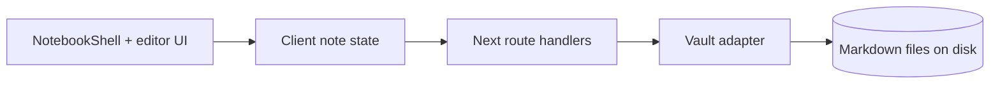
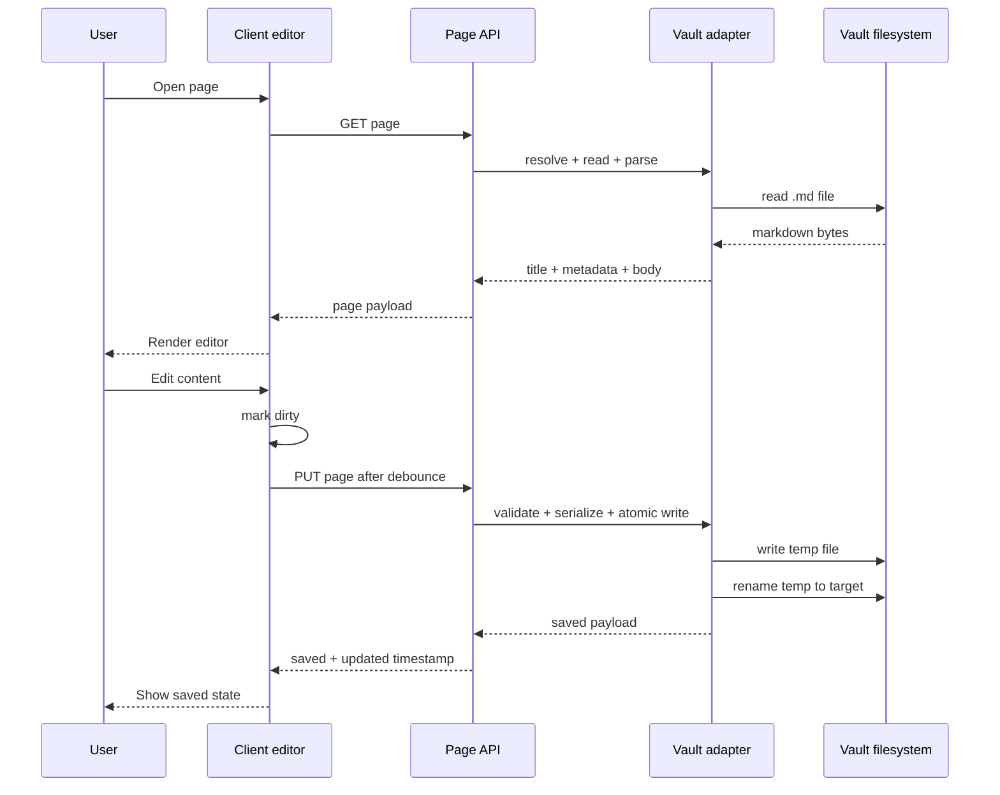
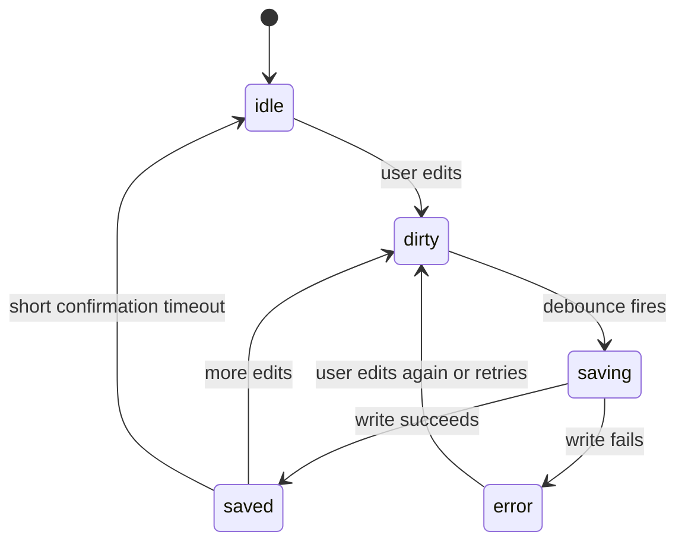

# SN-3 Core Note Reliability Architecture

## Purpose

`SN-3` is the first functional brief in the OneNote-first roadmap. Its job is to replace prototype-only note state with real vault-backed page persistence so a note can be opened, edited, autosaved, reloaded, and trusted.

This document focuses only on the `SN-3` boundary. It does not include broader notebook tree mutations, section moves, search, or AI behavior.

## Current State

Today the app shell is still prototype-driven:

- [src/components/notebook-shell.tsx](C:/Projects/smart-notes/src/components/notebook-shell.tsx) reads from `mock-data`
- [src/lib/app-state.tsx](C:/Projects/smart-notes/src/lib/app-state.tsx) keeps notebooks and pages in React memory
- [server.js](C:/Projects/smart-notes/server.js) already defines the vault root and serves vault assets under `/vault/*`
- [Docs/PRD.md](C:/Projects/smart-notes/Docs/PRD.md) defines Markdown files with YAML front matter as the source of truth

So `SN-3` is not a polish brief. It is the first real persistence layer.

## Scope

`SN-3` should deliver:

- open an existing page from the vault
- edit the page body and title
- autosave changes with visible status
- reload the app and recover the saved content
- create a new page inside an existing section if needed for the flow
- rename and delete a page if that is required to complete the core page lifecycle

`SN-3` should not deliver:

- notebook or section creation flows
- page moves between sections
- tree restructuring
- attachments, rich asset handling, search, or AI actions

## Architecture Summary

The architecture should stay local-first and simple:

1. Markdown files in the vault remain the source of truth.
2. YAML front matter stores page metadata.
3. A small server-side vault adapter owns path resolution, parsing, validation, and atomic writes.
4. Route handlers expose minimal page-focused APIs.
5. The client replaces in-memory page state with fetch/load/save behavior and autosave status.

## Proposed Layers



### Client Layer

The client should keep only view state and transient edit state:

- selected notebook/section/page ids
- current page draft
- save status: `idle`, `dirty`, `saving`, `saved`, `error`
- last loaded revision metadata for conflict-safe save behavior later

The client should stop treating the page body as durable state. React state becomes a draft over server-backed data.

### API Layer

For `SN-3`, the API surface should stay small and page-centric:

- `GET /api/page?path=...` or `GET /api/page/[...slug]` to load one page
- `PUT /api/page` to save body and metadata
- `POST /api/page` to create a page in an existing section
- `DELETE /api/page` for page deletion if included in the brief

This brief does not need a full mutable notebook tree API. A lightweight page API is enough to make notes real.

### Vault Adapter Layer

The vault adapter should be the only layer allowed to touch the filesystem. It should own:

- converting notebook/section/page identifiers or paths into safe absolute paths
- reading Markdown files
- parsing and serializing front matter
- computing updated timestamps
- writing through a temp file plus rename
- rejecting path traversal and invalid locations

Recommended module split:

- `src/server/vault/paths.ts`
- `src/server/vault/pages.ts`
- `src/server/vault/frontmatter.ts`

Exact file names can vary, but the separation should remain.

## Data Model

Each page remains a Markdown file with YAML front matter:

```yaml
---
title: Maxwell Lens Notes
created: 2026-05-25T18:12:00Z
updated: 2026-05-25T18:15:21Z
tags: [optics, ideas]
status: living
source:
  kind: manual
---
Page body starts here.
```

For `SN-3`, only a minimal subset of metadata needs active mutation support:

- `title`
- `updated`
- possibly `created` on create
- preserve unknown fields instead of dropping them

## Request Flow



## Autosave Behavior

The save loop should be predictable and conservative:

- debounce around 1 to 1.5 seconds after the last edit
- do not queue overlapping writes for the same page
- if a save is in flight, coalesce newer edits into the next save
- surface save errors clearly and keep the draft in memory
- on page switch, either flush pending edits or block the switch until save settles

Recommended state machine:



## Filesystem Safety

This is the most important engineering constraint in `SN-3`.

Rules:

- all page paths must resolve under the configured vault root
- no direct writes to the target file; use temp file then rename
- preserve file extension conventions: page files stay `.md`
- preserve adjacent `.assets` and annotation sidecars when renaming or deleting a page later
- avoid partial writes on process crash or request interruption

## UI Integration Plan

The current shell can be adapted without a full rewrite:

- keep the existing editor shell in [src/components/notebook-shell.tsx](C:/Projects/smart-notes/src/components/notebook-shell.tsx)
- replace `mockNotebooks` and direct in-memory page mutations with data fetched from the API
- keep structural tree changes out of this brief where possible
- introduce a small page client hook or service for load/save behavior

Recommended client seam:

- `src/lib/api/pages.ts` for fetch helpers
- `src/hooks/use-page-draft.ts` or equivalent for draft/autosave status

If the team prefers, the same logic can live inside a local store, but page persistence should remain isolated from the broader tree state.

## Error Cases To Handle

`SN-3` should explicitly handle:

- page file missing on open
- invalid or stale page path
- malformed front matter
- concurrent quick edits causing back-to-back saves
- save failure due to filesystem error
- rename collision if page rename is included

Expected product behavior is simple: do not lose the user’s typed content, and do not silently succeed when the file write failed.

## Testing Strategy

Evidence should match the brief size:

- unit tests for front matter parse/serialize behavior
- unit tests for safe path resolution
- unit tests for atomic page save behavior
- targeted integration test for `GET` and `PUT` page API flow
- one manual app check: edit a note, wait for autosave, reload, confirm content persists

E2E is optional for `SN-3` unless the owner wants the full UI flow captured as evidence.

## Open Design Decisions

These decisions should be confirmed while grooming `SN-3`:

- page identity: stable path-based identity vs generated ids mapped to paths
- whether create/rename/delete all belong in `SN-3` or only load/save
- whether title edits rename the backing filename immediately or keep title decoupled from filename
- whether page switching should hard-block until pending save completes

## Recommended First Cut

The safest first cut for `SN-3` is:

1. Load one page from the vault.
2. Edit body and title.
3. Autosave to the same file with atomic writes.
4. Reload and confirm persistence.

Then, only if the implementation stays clean, add create/rename/delete for pages inside existing sections.

That keeps the first functional milestone narrow: one real note, end to end, with no trust gap.
